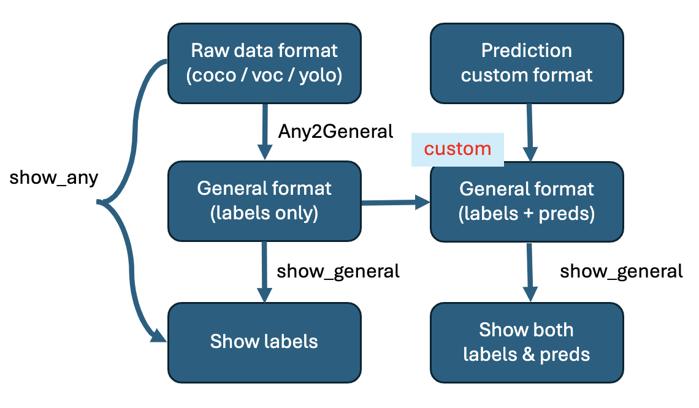
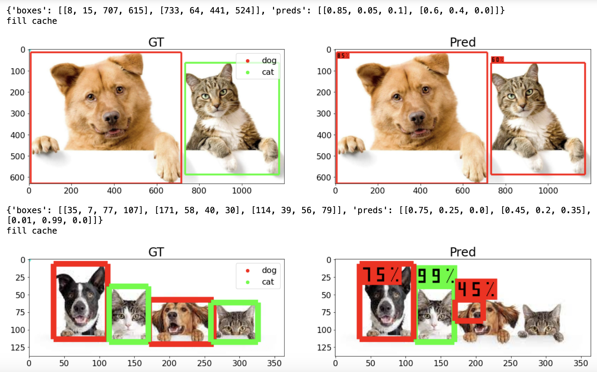
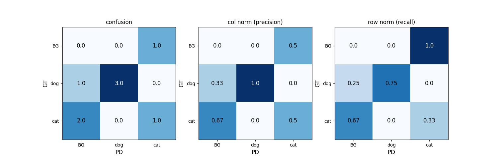
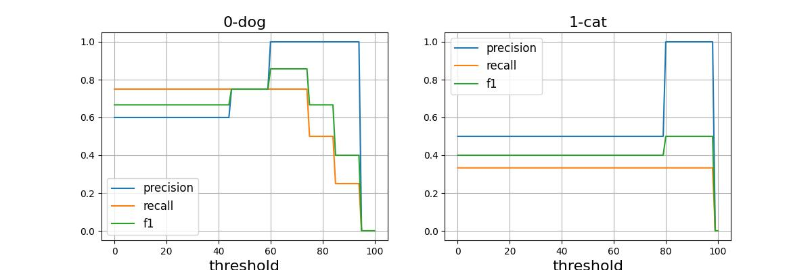

# COSMOs: Classification, Object detection, Segmentation MOduleS

## **Introduction**
This repo provides tools for common computer vision tasks.
+ Classification
    + `Output Analysis`
        + support tasks:
            + binary classification
            + binary classification treat class-0 as background
            + multi-class classification
            + multi-class classification treat class-0 as background
            + multi-label classification (multibinary, treat class-0 as background)
        + Comprehensive `metrics` e.g. AP, PR-Curves, Confusion matrices, threshold optimization, etc.
        + `Plotting` of the above metrics
        + `Export` data for label correctness
+ Object detection
    + `Format Conversion` between coco, voc, yolo and self-defined format [general](./example/detection/data/general.json).
    + `Visualization` of all the above formats for **labels** (and **predictions** if specified). The visualization tool automatically converts the data into general format in the cache directory in advance.
    + `Output Analysis`
        + Comprehensive `metrics` e.g. AP, PR-Curves, Confusion matrices, threshold optimization, etc.
        + `Plotting` of the above metrics
        + `Export` data for label correctness
+ Segmentation
    + `Visualization`
    + Comprehensive `Metrics`

## **Installation**
```bash
git clone https://github.com/bnbsking/COSMOs
pip install numpy matplotlib opencv-python
```

## **Quick Start - Classification**
+ Output Analysis:
    + Please conform your data format as either of one
        + [single_label](./example/classification/data/single_label.json)
        + [multilabel](./example/classification/data/multi_label.json)
        + [single_label_background](./example/classification/data/single_label_background.json)
    + The analysis pipeline is at [here](./cosmos/classification/output_analysis.yaml)
    + See more in the [example](./example/classification/output_analysis.ipynb)

```python
from cosmos.classification import ClassificationAnalysis

ClassificationAnalysis(
    ant_path = "example/classification/data/single_label.json",
    save_folder = "example/classification/output/single_label",
)
```


## **Quick Start - Object detection**
+ Format Conversion (see more in the [example](./example/detection/s2_format_conversion.ipynb))

```python
from cosmos.detection import coco2any

coco2any(
    tgt_foramt = "voc",
    img_folder = "example/detection/data/coco",
    ant_path = "example/detection/data/coco/coco.json",
    save_folder = "example/detection/output/visualization_gt_conversion/coco2voc"
)
```

or 

```python
from cosmos.detection import coco2general

coco2general(
    img_folder = "example/detection/data/coco",
    ant_path = "example/detection/data/coco/coco.json",
    save_path = "example/detection/output/visualization_gt_conversion/coco2general/general.json"
)
```

+ Visualization (see more in the [example](./example/detection/s1_visualization_gt_and_pd.ipynb))

```python
from cosmos.detection import show_coco

show_coco(
    img_name = f"pic0.jpg",
    img_folder = "example/detection/data/coco",
    ant_path = "example/detection/data/coco/coco.json"
)
```

or

```python
from cosmos.detection import show_general

show_general(
    img_name = f"pic0.jpg",
    ant_path = "example/detection/data/general.json",
)  # when the anntotation includes predictions it will be shown!
```

+ Output Analysis
    + Please use the above `Format conversion` to change data format as [general](./example/detection/data/general.json)
    + The analysis pipeline is at [here](./cosmos/detection/output_analysis.yaml)

```python
from cosmos.detection import DetectionAnalysis

DetectionAnalysis(
    ant_path = f"example/detection/data/general.json",
    save_folder = f"example/detection/output/metrics"
)
```

## **Concepts**
+ **[Classification]** Complicated tasks

| task                                          | label idx min | compute class-0 metrics | threshold optimization | data format |  
| -                                             | -             | -                       | -                      | -           |
| binary classification                         | 0             | V                       | V                      | [single_label](./example/classification/data/single_label.json)       |
| binary classification (cls-0 background)      | 1             |                         | V                      | [single_label_background](./example/classification/data/single_label_background.json) |
| multi-class classification                    | 0             | V                       |                        | single_label |
| multi-class classification (cls-0 background) | 1             |                         | V                      | single_label_background |
| multi-label classification (cls-0 background) | 0             |                         | V                      | [multi_label](./example/classification/data/multi_label.json)   |


+ **[Classification]** threshold optimization
    + `multi-class classification (cls-0 background)` checks whether prob-cls-0 < threshold, if yes, the pd-cls is pd[1:].argmax()
    + `multi-class classification (cls-0 background)` and `multi-label classification (cls-0 background)` take the mean of all optimized thresghold for each foreground class


+ **[Object Detection]** A general format, the most convenient

The formats can be summarized as following:
| format | extension | files     | type  | box                      | disadvantage |
| -      | -         | -         | -     | -                        | -            |
| coco   | .json     | 1         | int   | (xmin, ymin, w, h)       | get label of an image |
| yolo   | .txt      | len(imgs) | float | (cx, cy, w/2, h/2)       | visualization, compute metrics, etc. |
| voc    | .xml      | len(imgs) | int   | (xmin, ymin, xmax, ymax) | get class list |
| [general](./example/detection/data/general.json)| .json | 1 | int | (xmin, ymin, w, h) | **NO** |


## **Examples**
+ detection format conversion workflow


+ detection visualization


+ confusion


+ prf curves
